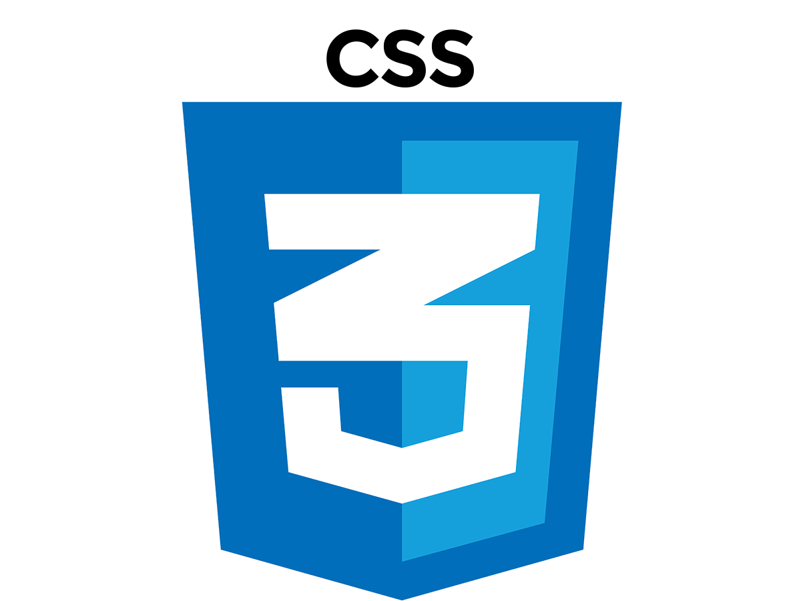

# Présentation

---

## Bonjour
 
 Je m'appelle SOUQUIERE Boris, et je suis en école pour développeur web chez O'Clock.
 
 Je suis une personne persévérante et curieuse, et je pourrais aussi ajouter que j'adore les jeux vidéos, la musique, la guitare électrique et les mangas.
 
 Disposant d'une envie de progresser sans fin. Je sais m'adapter rapidement.

# Compétences

---

## En cours d'acquisition

 

# Compétences futures envisagées

   
